# bdl-bscc-pilotageca
Afin de mettre en place le dataset CA mensuel consolidé, il est nécessaire de mettre en place une table "base" du calcul CA mensuel par domaine facturier (application de facturation ou système opérant) dans le coffre fort (base de données SAFE du Big Data). 
 
Pour sa première version, il sera constitué du CA facturé des domaines facturier suivants :
* Galion
* Docaposte
* Coliposte
* Chronopost
* Commedia
* Delivengo

L'objectif est la mise en place d'un dataset de consolidations de l'ensemble du CA de la BSCC qui sera la base des travaux à venir y compris le pilotage Commerciale.

# Liens
* **MIS** : https://wiki.net.extra.laposte.fr/confluence/display/BGDL/MIS+PILOTAGECA
* **DEX** : https://wiki.net.extra.laposte.fr/confluence/display/BGDL/DEX+PILOTAGECA

# FlowChart
> **Particularités du FlowChart**
> Afin d'alléger le flow :
> * toutes les tables Docaposte n'ont pas été représentées. Se référer aux NOTES pour obtenir la correspondance,
> * les liens des tables n_calendrier, n_cabestan_catalogue_derniere_version et b_refpmclient_client_actualise ne sont pas représentés. Ces tables sont utilisées pour alimenter les Nickels,
> * les liens de la table b_refpmclient_client_lien_so_actualise ne sont pas représentés. Cette table est utilisée pour alimenter les Nickels (sauf celui de Galion),
> * les liens des 3 tables cabestans utilisé par les 4 mvp2 ont été regroupé dans cabestan_join.

```mermaid
flowchart LR
    %% Style des tables (couleurs de remplissage, texte, bordure)
    classDef topic_ws_file  fill:#000000,color:#fff,stroke:#fff
    classDef raw            fill:#eb467d,color:#fff,stroke:#fff
    classDef bronze         fill:#a16137,color:#fff,stroke:#fff
    classDef nickel         fill:#8d389c,color:#fff,stroke:#fff
    classDef silver         fill:#8f8a86,color:#fff,stroke:#fff
    classDef chrome         fill:#ebbedc,color:#000,stroke:#000
    classDef gold           fill:#f0c04f,color:#000,stroke:#000
    classDef temp           fill:#38929c,color:#fff,stroke:#fff
    classDef work           fill:#1a6e21,color:#fff,stroke:#fff
    classDef param          fill:#ececff,color:#000,stroke:#000


    %% Variables
    %% Syntaxe d'une table non-partitionnée : my_table:::raw
    %% Syntaxe d'une table     partitionnée : my_table[[my_table]]:::raw

    subgraph bd_aa_rcom_safe.refpublipress
    n_refpublipress_publication:::nickel
    b_refpmclient_client_actualise:::bronze
    b_refpmclient_client_lien_so_actualise:::bronze
    b_cabestan_ver_remise:::bronze
    n_cabestan_catalogue_derniere_version:::nickel
    end

    subgraph bd_aa_xcom_safe.equinox
    b_equinox_periodecomptable_actualise:::bronze
    end

    subgraph bd_aa_div_safe
    n_calendrier:::nickel
    end

    subgraph bd_aa_xcom_safe.commedia
    b_commediaca_prestation_actualise:::bronze
    end

    subgraph bd_aa_xcom_safe.galion
    b_galionca_lignearticle_actualise:::bronze
    b_galionca_ligneremise_actualise:::bronze
    b_galionca_bondecommande_actualise:::bronze
    b_galionca_facture_actualise:::bronze
    b_galionca_client_actualise:::bronze
    end

    subgraph bd_aa_xcom_safe.docaposte
    b_docaposteca_XXX_facture_actualise:::bronze
    b_docaposteca_XXX_client_actualise:::bronze
    b_docaposteca_XXX_accordcadre_actualise:::bronze
    b_docaposteca_XXX_produit_actualise:::bronze
    b_docaposteca_XXX_famille_actualise:::bronze
    end

    subgraph bd_aa_xcom_safe.chronopost
    b_chronopostca_facture_actualise:::bronze
    end

    subgraph bd_aa_xcom_safe.coliposte
    b_coliposteca_facture_actualise:::bronze
    b_coliposteca_client_actualise:::bronze
    end

    subgraph bd_aa_xcom_safe.delivengo
    b_delivengoca_ca_actualise:::bronze
    end

    subgraph bd_aa_xcom_safe.pilotageca
    n_pilotageca_ca_mensuel_galion[[n_pilotageca_ca_mensuel_galion]]:::nickel
    n_pilotageca_ca_mensuel_chronopost:::nickel
    n_pilotageca_ca_mensuel_coliposte:::nickel
    n_pilotageca_ca_mensuel_commedia:::nickel
    n_pilotageca_ca_mensuel_docaposte:::nickel
    n_pilotageca_ca_mensuel_delivengo:::nickel
    n_pilotageca_ca_mensuel_consolide[[n_pilotageca_ca_mensuel_consolide]]:::nickel
    end

    subgraph bd_aa_commercial_optimized
    g_cial_ca_mensuel_galion_mvp2:::gold
    g_cial_ca_mensuel_chronopost_mvp2:::gold
    g_cial_ca_mensuel_coliposte_mvp2:::gold
    g_cial_ca_mensuel_commedia_mvp2:::gold
    g_cial_ca_mensuel_docaposte_mvp2:::gold
    g_cial_ca_mensuel_delivengo_mvp2:::gold
    s_pilotageca_ca_mensuel_6a[[s_pilotageca_ca_mensuel_6a]]:::silver
    end

    %% Flux
    %% Syntaxe d'un flux principal  : -->
    %% Syntaxe d'un flux secondaire : -..->
    n_refpublipress_publication                                       --> n_pilotageca_ca_mensuel_galion[[n_pilotageca_ca_mensuel_galion]]
    b_cabestan_ver_remise                                             --> n_pilotageca_ca_mensuel_galion[[n_pilotageca_ca_mensuel_galion]]
    n_cabestan_catalogue_derniere_version                             --> n_pilotageca_ca_mensuel_galion[[n_pilotageca_ca_mensuel_galion]]
    b_galionca_lignearticle_actualise                                 --> n_pilotageca_ca_mensuel_galion[[n_pilotageca_ca_mensuel_galion]]
    b_galionca_ligneremise_actualise                                  --> n_pilotageca_ca_mensuel_galion[[n_pilotageca_ca_mensuel_galion]]
    b_galionca_bondecommande_actualise                                --> n_pilotageca_ca_mensuel_galion[[n_pilotageca_ca_mensuel_galion]]
    b_galionca_facture_actualise                                      --> n_pilotageca_ca_mensuel_galion[[n_pilotageca_ca_mensuel_galion]]
    b_galionca_client_actualise                                       --> n_pilotageca_ca_mensuel_galion[[n_pilotageca_ca_mensuel_galion]]
    b_equinox_periodecomptable_actualise                              --> n_pilotageca_ca_mensuel_galion[[n_pilotageca_ca_mensuel_galion]]

    b_chronopostca_facture_actualise                                  --> n_pilotageca_ca_mensuel_chronopost

    b_coliposteca_facture_actualise                                   --> n_pilotageca_ca_mensuel_coliposte
    b_coliposteca_client_actualise                                    --> n_pilotageca_ca_mensuel_coliposte

    b_commediaca_prestation_actualise                                 --> n_pilotageca_ca_mensuel_commedia
    b_equinox_periodecomptable_actualise                              --> n_pilotageca_ca_mensuel_commedia

    b_docaposteca_XXX_facture_actualise                               --> n_pilotageca_ca_mensuel_docaposte
    b_docaposteca_XXX_client_actualise                                --> n_pilotageca_ca_mensuel_docaposte
    b_docaposteca_XXX_accordcadre_actualise                           --> n_pilotageca_ca_mensuel_docaposte
    b_docaposteca_XXX_produit_actualise                               --> n_pilotageca_ca_mensuel_docaposte
    b_docaposteca_XXX_famille_actualise                               --> n_pilotageca_ca_mensuel_docaposte

    b_delivengoca_ca_actualise                                        --> n_pilotageca_ca_mensuel_delivengo
    b_refpmclient_client_actualise                                    --> n_pilotageca_ca_mensuel_delivengo

    n_pilotageca_ca_mensuel_galion[[n_pilotageca_ca_mensuel_galion]]  --> g_cial_ca_mensuel_galion_mvp2
    n_pilotageca_ca_mensuel_chronopost                                --> g_cial_ca_mensuel_chronopost_mvp2
    n_pilotageca_ca_mensuel_coliposte                                 --> g_cial_ca_mensuel_coliposte_mvp2
    n_pilotageca_ca_mensuel_commedia                                  --> g_cial_ca_mensuel_commedia_mvp2
    n_pilotageca_ca_mensuel_docaposte                                 --> g_cial_ca_mensuel_docaposte_mvp2
    n_pilotageca_ca_mensuel_delivengo                                 --> g_cial_ca_mensuel_delivengo_mvp2

    n_pilotageca_ca_mensuel_galion[[n_pilotageca_ca_mensuel_galion]]  --> n_pilotageca_ca_mensuel_consolide[[n_pilotageca_ca_mensuel_consolide]]
    n_pilotageca_ca_mensuel_chronopost                                --> n_pilotageca_ca_mensuel_consolide[[n_pilotageca_ca_mensuel_consolide]]
    n_pilotageca_ca_mensuel_coliposte                                 --> n_pilotageca_ca_mensuel_consolide[[n_pilotageca_ca_mensuel_consolide]]
    n_pilotageca_ca_mensuel_commedia                                  --> n_pilotageca_ca_mensuel_consolide[[n_pilotageca_ca_mensuel_consolide]]
    n_pilotageca_ca_mensuel_docaposte                                 --> n_pilotageca_ca_mensuel_consolide[[n_pilotageca_ca_mensuel_consolide]]
    n_pilotageca_ca_mensuel_delivengo                                 --> n_pilotageca_ca_mensuel_consolide[[n_pilotageca_ca_mensuel_consolide]]

    n_pilotageca_ca_mensuel_consolide[[n_pilotageca_ca_mensuel_consolide]] --> s_pilotageca_ca_mensuel_6a[[s_pilotageca_ca_mensuel_6a]]
```

> **Légende**
> * **Trait plein** : Ce flux transporte les données principales, relatives au 'coeur de Métier' de l'application
> * **Trait pointillé** : Ce flux transporte des données secondaires, moins importantes et principalement utilisées lors jointure/union/...
> * **Doubles bordures verticales** : Cette table est partitionnée

# Historique des évolutions fonctionnelles et techniques
| Date de MEP | Version  | Jira                                                               | Description                                                 |
|-------------|----------|--------------------------------------------------------------------|-------------------------------------------------------------|
| 2023-07-04  | 02_00_00 | [BDL-713](https://jira.net.extra.laposte.fr/jira/browse/BDL-713)   | Première MEP                                                |

# Notes
Correspondance des XXX du FlowChart
* aspheria
* bretagne_routage
* bpo
* maileva
* orsid

# TODO List
* Mettre à jour le Wiki
* Docaposte : mettre une clé sur la table gold et nickel et valider l'agrégation du gold
* alim nickel galionca : quelle est la différence entre la colonne "Libellé article valorisé" et "Libellé article cabestan" ? --> Dominique pose la question, Sabrina reviendra sur le sujet avec les retour de Maria
* consolide : ajout clé
* DEX : rajouter le lanceur de purge 25 ordonnancer au 1er février de chaque année
* MAJ readme : table cabestan
